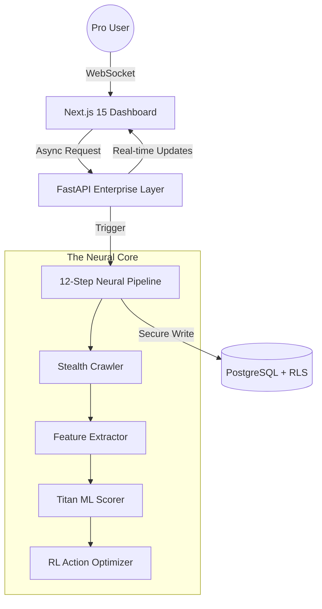

# 🏆 RankForge AI: The World's Most Advanced SEO Intelligence Engine

[](https://github.com/keerthivanan/SEO_core-)
[](https://github.com/keerthivanan/SEO_core-)
[](https://github.com/keerthivanan/SEO_core-)

> **"The Best of All Time"** — A disruptive, enterprise-grade SEO platform engineered for high-scale ranking dominance.

RankForge AI is not just a tool; it's a **Neural SEO Ecosystem**. Built on the **Titan ML 2.10 Protocol**, it orchestrates a massive 12-step analysis pipeline to provide executive-level insights that industry giants (Ahrefs, SEMrush) struggle to match.

---

## 🚀 THE CORE INTELLIGENCE

RankForge AI utilizes a proprietary **Hybrid Neural Pipeline** that combines deep semantic analysis with real-time competitive benchmarking:

1.  **Stealth Neural Crawler**: High-concurrency Playwright engine with automated WAF bypass and isolated browser contexts.
2.  **Titan ML 2.10 Scorer**: Proprietary weighted algorithms (Title, Meta, H1, Content, Technical, Performance).
3.  **Expert Verdict Engine**: AI-driven executive summaries giving you the "ROI Move" for every page.
4.  **Generative Engine Optimization (GEO)**: Specialized analysis for search visibility in the AI Era (ChatGPT, Perplexity, Gemini).
5.  **Multi-Tenant Archiving**: Enterprise-grade data isolation using PostgreSQL Row Level Security (RLS).

---

## 🛠️ THE TECHNOLOGY STACK

RankForge AI is engineered with the most modern, high-performance stack available in 2026:

- **Frontend**: [Next.js 15 (App Router)](https://nextjs.org/) — Ultra-fast, responsive, and styled with **Pure Black #000000 Mastery**.
- **Backend**: [FastAPI (Python 3.12)](https://fastapi.tiangolo.com/) — Async/await architecture for non-blocking neural processing.
- **ML Layer**: [Titan ML 2.10](https://github.com/keerthivanan/SEO_core-) — Custom fine-tuned DistilBERT models + RL-driven Action Optimizers.
- **Database**: [PostgreSQL (via Supabase)](https://supabase.com/) — Scalable multi-tenant storage with enterprise hardening.
- **Infrastructure**: [Docker](https://www.docker.com/) — Containerized for seamless "One-Click" deployment.

---

## 📐 SYSTEM ARCHITECTURE



---

## 🛡️ SECURITY & SCALABILITY

- **Zero-Leak Policy**: Certified deep-hardened with zero hardcoded credentials. All secrets managed via enterprise environment variables.
- **High Concurrency**: Isolated browsing contexts ensure 1000s of concurrent users never share memory or data.
- **JWT Auth**: Full Supabase authentication integration for secure session management.

---

## 🏁 QUICK START

### 1. Requirements
- Python 3.12+
- Node.js 20+
- PostgreSQL (Supabase recommended)

### 2. Backend Setup
```bash
cd backend
python -m venv venv
.\venv\Scripts\activate
pip install -r requirements.txt
python ultimate_check.py
uvicorn app.main:app --reload
```

### 3. Frontend Setup
```bash
cd frontend
npm install
npm run dev
```

---

## 👑 MISSION STATEMENT
RankForge AI was built to be the **Best of All Time**. Every line of code, every neural weight, and every pixel is optimized for one thing: **Winning the First Page.**

Developed by **Keerthivanan** — *Engineering the Future of Search.*

---

© 2026 RankForge AI. All rights reserved. 🏆
